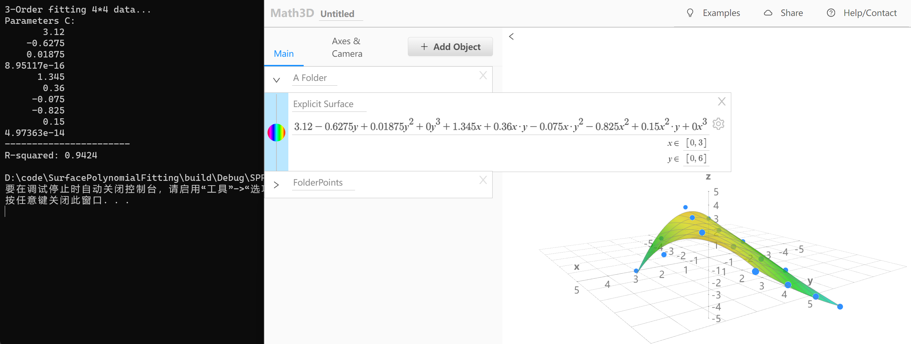
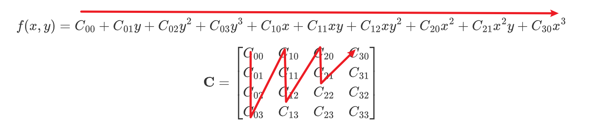

# SurfacePolynomialFitting
N-order polynomial surface fitting with Eigen. Usage: `SPF ${N}`，N can be any natural number.

* N=2
  
  $$
  f(x,y) = C_{00}+C_{01}y+C_{02}y^2+C_{10}x+C_{11}xy+C_{20}x^2
  $$

  $$
  \mathbf{C} = \begin{bmatrix} C_{00} & C_{10} & C_{20} \\ C_{01} & C_{11} & C_{21} \\ C_{02} & C_{12} & C_{22} \end{bmatrix}
  $$

* N=3
  
  $$
  f(x,y) = C_{00}+C_{01}y+C_{02}y^2+C_{03}y^3+C_{10}x+C_{11}xy+C_{12}xy^2+C_{20}x^2+C_{21}x^2y+C_{30}x^3
  $$

  $$
  \mathbf{C} = \begin{bmatrix} C_{00} & C_{10} & C_{20} & C_{30} \\ C_{01} & C_{11} & C_{21} & C_{31} \\ C_{02} & C_{12} & C_{22} & C_{32} \\ C_{03} & C_{13} & C_{23} & C_{33} \end{bmatrix}
  $$

---------------

