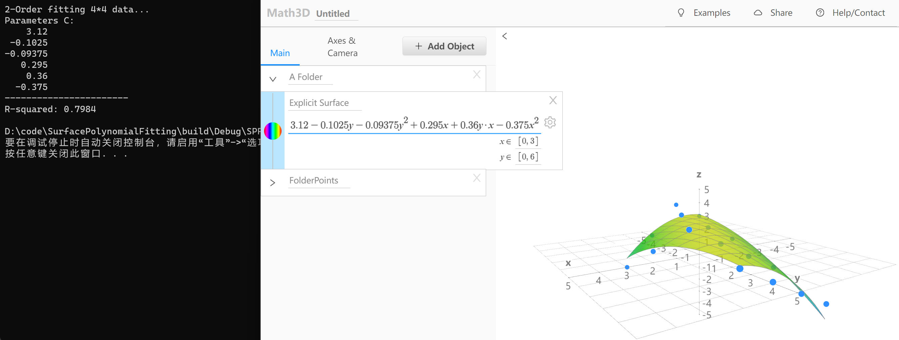
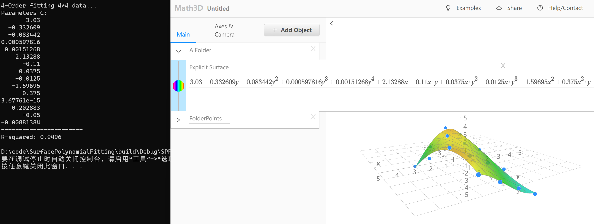
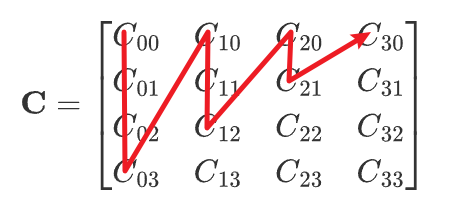
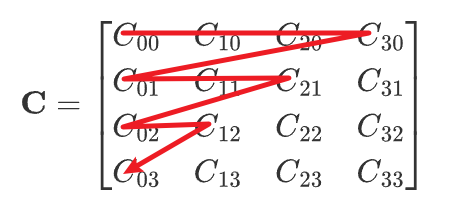

# Surface Polynomial Fitting
N-order polynomial surface fitting with Eigen (Least squares).

## Usage

```
git clone -b main --recursive https://github.com/nescirem/SurfacePolynomialFitting.git 
cd SurfacePolynomialFitting
mkdir build && cd build
cmake ..
make
```

Execute`./SPF ${N}`，N can be any natural number.

* N=2

$$
\begin{array}{ll} f(x,y)=
& C_{00}+C_{01}y+C_{02}y^2 \\\
&+ C_{10}x+C_{11}xy \\\
&+ C_{20}x^2
\end{array}
$$

$$
\mathbf{C} = \begin{bmatrix} C_{00} & C_{10} & C_{20} \\\ C_{01} & C_{11} & C_{21} \\\ C_{02} & C_{12} & C_{22} \end{bmatrix}
$$



* N=3

$$
\begin{array}{ll} f(x,y) = 
& C_{00}+C_{01}y+C_{02}y^2+C_{03}y^3 \\\
&+ C_{10}x+C_{11}xy+C_{12}xy^2 \\\
&+ C_{20}x^2+C_{21}x^2y \\\
&+ C_{30}x^3
 \end{array}
$$

$$
\mathbf{C} = \begin{bmatrix} C_{00} & C_{10} & C_{20} & C_{30} \\\ C_{01} & C_{11} & C_{21} & C_{31} \\\ C_{02} & C_{12} & C_{22} & C_{32} \\\ C_{03} & C_{13} & C_{23} & C_{33} \end{bmatrix}
$$


* N=4

$$
\begin{array}{ll} f(x,y) = 
& C_{00}+C_{01}y+C_{02}y^2+C_{03}y^3+C_{04}y^4 \\\
&+ C_{10}x+C_{11}xy+C_{12}xy^2+C_{13}xy^3 \\\
&+ C_{20}x^2+C_{21}x^2y+C_{22}x^2y^2 \\\
&+ C_{30}x^3+C_{31}x^3y\\\
&+ C_{40}x^4
\end{array}
$$

$$
\mathbf{C} = \begin{bmatrix} C_{00} & C_{10} & C_{20} & C_{30} & C_{40} \\\ C_{01} & C_{11} & C_{21} & C_{31} & C_{41} \\\ C_{02} & C_{12} & C_{22} & C_{32} & C_{42} \\\ C_{03} & C_{13} & C_{23} & C_{33} & C_{43} \\\ C_{04} & C_{14} & C_{24} & C_{34} & C_{44} \end{bmatrix}
$$



---------------

## Details

A detailed explanation of the least squares fitting of a two-variable N-order orthogonal polynomial for a dataset with $m=3\times{}2=6$ (using N=3 as an example):

$$
\begin{array}{ll} f(x,y) =
& C_{00}+C_{01}y+C_{02}y^2+C_{03}y^3 & \\\
&+ C_{10}x+C_{11}xy+C_{12}xy^2 \\\
&+ C_{20}x^2+C_{21}x^2y \\\
&+ C_{30}x^3
 \end{array}
$$

The sum of the squared errors for each data point within the dataset is:

$$
\begin{array}{lcl} e 
& = & \sum_{k=1}^{m}[f(x_k,y_k)-z_k]^2 \\\
& = & \sum_{k=1}^{m}[C_{00}+C_{01}y_k+C_{02}y_k^2+C_{03}y_k^3 + C_{10}x_k+C_{11}x_ky_k+C_{12}x_ky_k^2+ C_{20}x_k^2+C_{21}x_k^2y_k+ C_{30}x_k^3-z_k]^2
\end{array}
$$

The least squares method considers that the optimal coefficients $C_{ij}$ of the function should make the sum of squared errors in the above expression approach zero. Therefore, for the optimal solution function, the following equation holds (Note: here the independent variables are the coefficients $C_{ij}$):

$$
\frac{\partial{e}}{\partial{C_{00}}} =
2\sum_{k=1}^{m}[C_{00}+C_{01}y_k+C_{02}y_k^2+C_{03}y_k^3 + 
C_{10}x_k+C_{11}x_ky_k+C_{12}x_ky_k^2 +
C_{20}x_k^2+C_{21}x_k^2y_k + 
C_{30}x_k^3-z_k] = 0
$$

$$
\frac{\partial{e}}{\partial{C_{01}}} = 
2\sum_{k=1}^{m}[C_{00}+C_{01}y_k+C_{02}y_k^2+C_{03}y_k^3 + 
C_{10}x_k+C_{11}x_ky_k+C_{12}x_ky_k^2 + 
C_{20}x_k^2+C_{21}x_k^2y_k + 
C_{30}x_k^3-z_k]y_k = 0
$$

$$
\frac{\partial{e}}{\partial{C_{02}}} = 
2\sum_{k=1}^{m}[C_{00}+C_{01}y_k+C_{02}y_k^2+C_{03}y_k^3 + 
C_{10}x_k+C_{11}x_ky_k+C_{12}x_ky_k^2 + 
C_{20}x_k^2+C_{21}x_k^2y_k + 
C_{30}x_k^3-z_k]y_k^2 = 0
$$

$$
\frac{\partial{e}}{\partial{C_{03}}} = 
2\sum_{k=1}^{m}[C_{00}+C_{01}y_k+C_{02}y_k^2+C_{03}y_k^3 + 
C_{10}x_k+C_{11}x_ky_k+C_{12}x_ky_k^2 + 
C_{20}x_k^2+C_{21}x_k^2y_k + 
C_{30}x_k^3-z_k]y_k^3 = 0
$$

$$
\frac{\partial{e}}{\partial{C_{10}}} = 
2\sum_{k=1}^{m}[C_{00}+C_{01}y_k+C_{02}y_k^2+C_{03}y_k^3 + 
C_{10}x_k+C_{11}x_ky_k+C_{12}x_ky_k^2 + 
C_{20}x_k^2+C_{21}x_k^2y_k + 
C_{30}x_k^3-z_k]x_k = 0
$$

$$
\frac{\partial{e}}{\partial{C_{11}}} = 
2\sum_{k=1}^{m}[C_{00}+C_{01}y_k+C_{02}y_k^2+C_{03}y_k^3 + 
C_{10}x_k+C_{11}x_ky_k+C_{12}x_ky_k^2 + 
C_{20}x_k^2+C_{21}x_k^2y_k + 
C_{30}x_k^3-z_k]x_ky_k = 0
$$

$$
\frac{\partial{e}}{\partial{C_{12}}} = 
2\sum_{k=1}^{m}[C_{00}+C_{01}y_k+C_{02}y_k^2+C_{03}y_k^3 + 
C_{10}x_k+C_{11}x_ky_k+C_{12}x_ky_k^2 + 
C_{20}x_k^2+C_{21}x_k^2y_k + 
C_{30}x_k^3-z_k]x_ky_k^2 = 0
$$

$$
\frac{\partial{e}}{\partial{C_{20}}} = 
2\sum_{k=1}^{m}[C_{00}+C_{01}y_k+C_{02}y_k^2+C_{03}y_k^3 + 
C_{10}x_k+C_{11}x_ky_k+C_{12}x_ky_k^2 + 
C_{20}x_k^2+C_{21}x_k^2y_k + 
C_{30}x_k^3-z_k]x_k^2 = 0
$$

$$
\frac{\partial{e}}{\partial{C_{21}}} = 
2\sum_{k=1}^{m}[C_{00}+C_{01}y_k+C_{02}y_k^2+C_{03}y_k^3 + 
C_{10}x_k+C_{11}x_ky_k+C_{12}x_ky_k^2 + 
C_{20}x_k^2+C_{21}x_k^2y_k + 
C_{30}x_k^3-z_k]x_k^2y_k = 0
$$

$$
\frac{\partial{e}}{\partial{C_{30}}} = 
2\sum_{k=1}^{m}[C_{00}+C_{01}y_k+C_{02}y_k^2+C_{03}y_k^3 + 
C_{10}x_k+C_{11}x_ky_k+C_{12}x_ky_k^2 + 
C_{20}x_k^2+C_{21}x_k^2y_k + 
C_{30}x_k^3-z_k]x_k^3 = 0
$$

The $a=(N+1)\times{}(N+2)/2=10$ equations above can be simplified to an $m\times{}a$ matrix times $a\times1$ matrix equals to  $m\times1$ matrix  form:

$$
\mathbf{X}\vec{\mathbf{c}} = \vec{\mathbf{z}}
$$

$$
\mathbf{X} =  
\begin{bmatrix} 
1 & \sum_{k=1}^my_k & \sum_{k=1}^my_k^2 & \sum_{k=1}^my_k^3 & \sum_{k=1}^mx_k & \sum_{k=1}^mx_ky_k & \sum_{k=1}^mx_ky_k^2 & \sum_{k=1}^mx_k^2 & \sum_{k=1}^mx_k^2y_k & \sum_{k=1}^mx_k^3 \\\
1 & \sum_{k=1}^my_k & \sum_{k=1}^my_k^2 & \sum_{k=1}^my_k^3 & \sum_{k=1}^mx_k & \sum_{k=1}^mx_ky_k & \sum_{k=1}^mx_ky_k^2 & \sum_{k=1}^mx_k^2 & \sum_{k=1}^mx_k^2y_k & \sum_{k=1}^mx_k^3 \\\
1 & \sum_{k=1}^my_k & \sum_{k=1}^my_k^2 & \sum_{k=1}^my_k^3 & \sum_{k=1}^mx_k & \sum_{k=1}^mx_ky_k & \sum_{k=1}^mx_ky_k^2 & \sum_{k=1}^mx_k^2 & \sum_{k=1}^mx_k^2y_k & \sum_{k=1}^mx_k^3 \\\
1 & \sum_{k=1}^my_k & \sum_{k=1}^my_k^2 & \sum_{k=1}^my_k^3 & \sum_{k=1}^mx_k & \sum_{k=1}^mx_ky_k & \sum_{k=1}^mx_ky_k^2 & \sum_{k=1}^mx_k^2 & \sum_{k=1}^mx_k^2y_k & \sum_{k=1}^mx_k^3 \\\
1 & \sum_{k=1}^my_k & \sum_{k=1}^my_k^2 & \sum_{k=1}^my_k^3 & \sum_{k=1}^mx_k & \sum_{k=1}^mx_ky_k & \sum_{k=1}^mx_ky_k^2 & \sum_{k=1}^mx_k^2 & \sum_{k=1}^mx_k^2y_k & \sum_{k=1}^mx_k^3 \\\
1 & \sum_{k=1}^my_k & \sum_{k=1}^my_k^2 & \sum_{k=1}^my_k^3 & \sum_{k=1}^mx_k & \sum_{k=1}^mx_ky_k & \sum_{k=1}^mx_ky_k^2 & \sum_{k=1}^mx_k^2 & \sum_{k=1}^mx_k^2y_k & \sum_{k=1}^mx_k^3 
\end{bmatrix}
$$

$$
\vec{\mathbf{c}} = 
\begin{bmatrix}
C_{00} \\\
C_{01} \\\
C_{02} \\\
C_{03} \\\
C_{10} \\\
C_{11} \\\
C_{12} \\\
C_{20} \\\
C_{21} \\\
C_{30}
\end{bmatrix}
\quad{}\quad{}\quad{}
\vec{\mathbf{z}} =
\begin{bmatrix}
z_0 \\\
z_1 \\\
z_2 \\\
z_3 \\\
z_4 \\\
z_5
\end{bmatrix}
$$

The $\vec{\mathbf{c}}$ is ordered as: 



U can change this order as:



by change that code:

```cpp
//X(k, index++) = std::pow(x, i) * std::pow(y, j); // C_{00},C{01},...
X(k, index++) = std::pow(x, j) * std::pow(y, i); // C_{00},C_{10},...
```

That's all.
